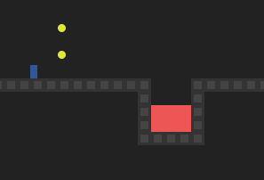

# Mortal-Lava

Mortal-Lava est un jeu de plateforme en JavaScript inspiré de classiques, où le joueur doit éviter la lave et collecter des pièces. Ce projet inclut un compteur automatique de morts qui s’incrémente à chaque fois que le joueur meurt et recommence le niveau.

---

## Fonctionnalités

- Contrôles au clavier pour déplacer le joueur (flèches gauche, droite, haut pour sauter).
- Mécanique de gravité, collisions avec les murs, la lave et les pièces.
- Niveaux multiples avec progression.
- Compteur de morts affiché en temps réel.
- Son d’ambiance.

---

## Installation & utilisation

1. Clonez ou téléchargez le projet.
2. Ouvrez le fichier `index.html` dans un navigateur moderne (Chrome, Firefox, Edge).
3. Le compteur de morts est visible en haut de la page.
4. Jouez avec les flèches directionnelles.

---

## Structure du projet

- `index.html` : page principale avec le conteneur du jeu.
- `game.js` : logique complète du jeu.
- `styles.css` : styles pour l’affichage du jeu.

---

## Contrôles

- Flèche gauche : déplacer à gauche
- Flèche droite : déplacer à droite
- Flèche haut : sauter

---

## Contribution

Les contributions sont les bienvenues ! Merci de forker le projet et de proposer vos améliorations via pull request.

---

## Auteur

Sidney NGUYEN.